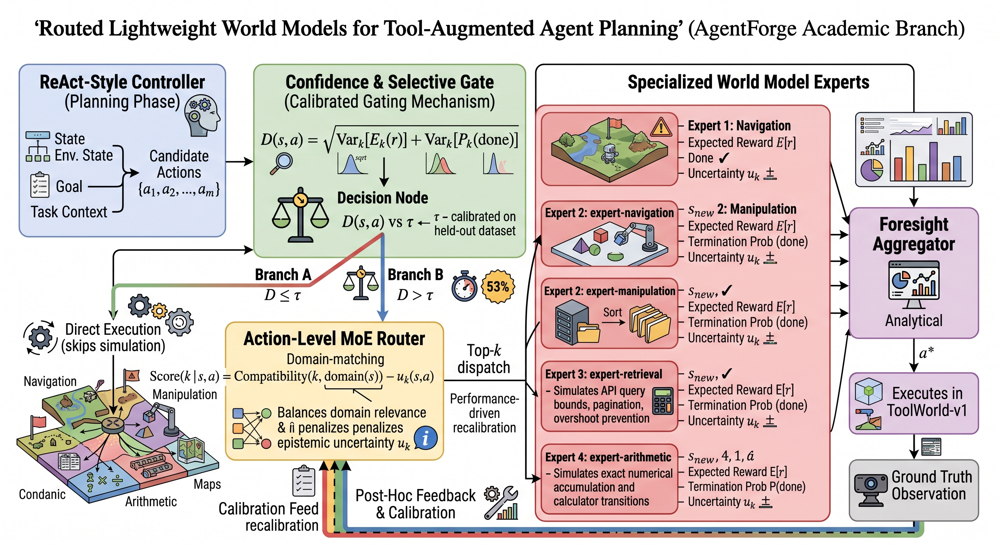
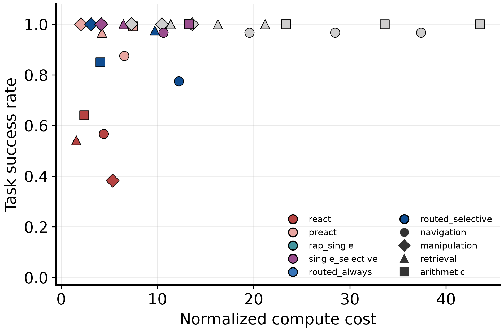
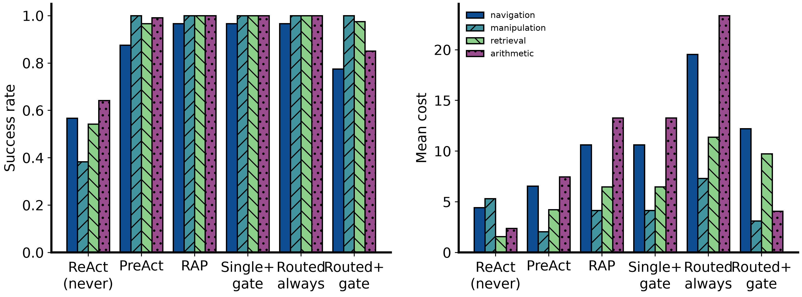
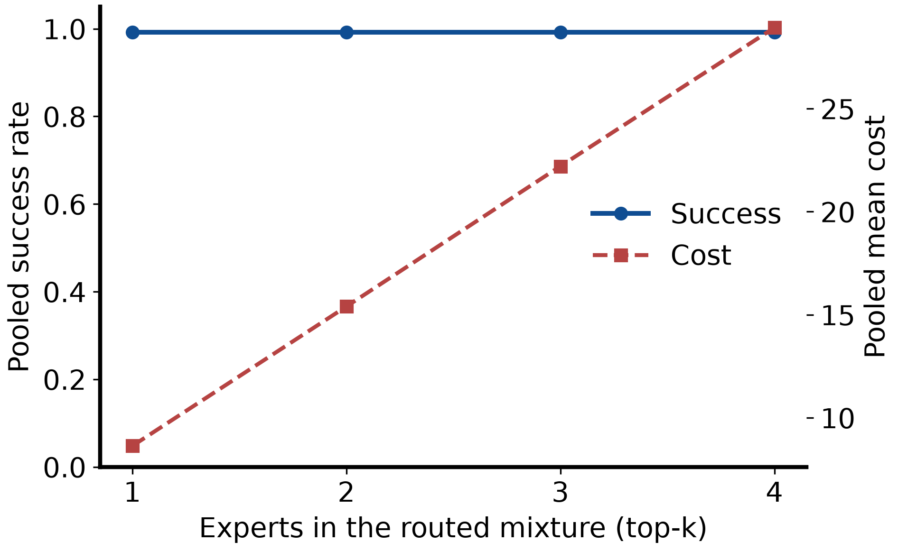
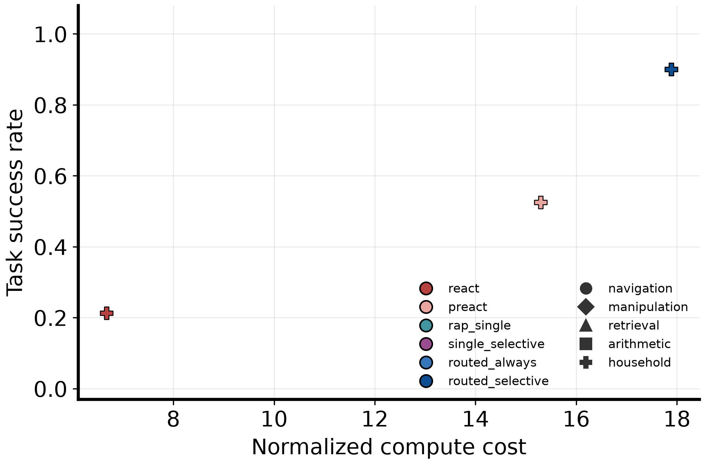

> **You are on the cademic branch.** This landing page is the CPU-only ToolWorld-v1 study. The product runtime, console, and measured product evals are on the main branch.

# AgentForge Academic Branch

[](https://www.python.org/downloads/)
[](https://numpy.org/)
[](LICENSE)

Routed lightweight world models for tool-augmented agent planning.
Parent product: [../README.md](../README.md). On GitHub, switch to the
`academic` branch to see this write-up as the repository landing page.
Product tables named
`WorldModel` and the product runtime `tool.foresight` event (a cheap
tool-outcome simulator: AST / retrieval preview / SQL validate) are **not**
this package and are not RAP.

**Closed loop.** Question → method → pre-registered hypotheses → ToolWorld-v1
experiment → Household-v1 check → figures → this README. Official ALFWorld,
ScienceWorld, τ-bench, LoRA, and an LLM controller are out of scope.

## Tech stack

| Layer | Choice | Role |
|---|---|---|
| Language | Python 3.12+ | Package `agentforge-academic` |
| Numerics | NumPy 2 | Environments, bootstrap CIs, tabular counts |
| Config | PyYAML | `configs/*.yaml` |
| Figures | Matplotlib 3.9 (Agg) | Pareto, ablation, expert-count PNG/PDF |
| Experts (main) | Dirichlet / Laplace tabular posteriors | Four domain WMs + generic `*` |
| Experts (optional) | One frozen instruct LM, prompt specialists | `backend: prompted`; no weight update |
| Tests | pytest 8 | 28 cases; never download Hugging Face weights |
| Optional extra | `pip install -e ".[llm]"` + CUDA or CPU torch | Frozen inference only |

There is no LoRA, no training loop, no W&B, and no ALFWorld dependency.

## Package layout

```text
academic/
  pyproject.toml                   package agentforge-academic
  configs/synthetic.yaml           ToolWorld-v1 main experiment
  configs/household.yaml           Household-v1 check (not ALFWorld)
  configs/llm_fake.yaml            Prompted FakeEngine smoke
  configs/llm_cpu.yaml             optional frozen CPU LM
  configs/llm_gpu.yaml             optional frozen GPU LM
  src/agentforge_academic/
    environment.py                 ToolWorld-v1 (four domains)
    household.py                   Household-v1 rooms / take / put
    experts.py                     Dirichlet/Laplace tabular WMs + generic *
    router.py                      action-level top-k MoERouter
    foresight.py                   disagreement gate + model rollout
    agents.py                      ReAct, RAP, PreAct, Routed+gate
    evaluation.py                  success, cost, MAE, Brier, bootstrap CI
    experiment.py                  CLI: fit → calibrate → test → figures
    trajectory.py                  JSONL adapter; ALFWorld export must be numeric
    prompted.py / llm_engine.py    optional frozen instruct LM experts
    plotting.py                    Pareto / ablation / expert-count figures
  tests/                           28 cases; no Hugging Face downloads
  figures/                         architecture + result plots checked in
```

CLI: `python -m agentforge_academic.experiment` or the `agentforge-academic`
console script after `pip install -e .`.

## Question

> Can a confidence-gated mixture of small, domain-specialized world models
> reduce foresight computation while preserving task success and one-step
> prediction quality?

Existing lines use one large model as planner and simulator (RAP, PreAct) or
one knowledge model (Qiao et al. WKM). This branch measures **action-level**
routing of several cheap simulators plus a calibrated skip gate.

## Architecture



Calibration uses held-out trajectories. Experts do not update weights at test
time. Ground-truth observations score predictions after the action is chosen.

```text
f_k(s, a) -> (p_k(s'|s,a), E[r], P(done), u_k)
score(k | s,a) = compatibility(k, domain(s)) - u_k(s,a)
D(s,a) = sqrt( Var_k[E_k(r)] + Var_k[P_k(done)] )
tau = quantile_q(D on held-out calibration)
```

Unseen tabular keys return uncertainty 1. If any candidate is gated in, the
controller chooses among **simulated** candidates only. Ground truth is read
**after** the action, only to score MAE / Brier.

| Expert | Domain | What a myopic heuristic misses |
|---|---|---|
| `expert-navigation` | movement | Hidden hazard; `jump` can skip it |
| `expert-manipulation` | object use | Correct `grasp` is `target` |
| `expert-retrieval` | query/API | Exact progress; `retrieve(2)` overshoots |
| `expert-arithmetic` | calculation | Exact sum; always-`add(2)` fails |

## Controllers (what is actually run)

| Agent class | README label | Foresight |
|---|---|---|
| `ReActAgent` | ReAct (never) | none (myopic heuristic) |
| `PreActAgent` | PreAct (depth 1) | single generic WM, depth 1 |
| `RAPAgent` | RAP (generic, depth 3) | single generic WM, depth 3 |
| `RoutedForesightAgent` | Routed always / +gate / top-k | mixture of specialists; optional skip gate |

Metrics written per episode: success, steps, cost
(`1.0 × controller + 0.35 × expert steps`), foresight calls, one-step reward
MAE, terminal Brier score. Pooled tables use bootstrap 95% CIs (seed 23).

This package's RAP/PreAct labels are **tabular-world baselines in ToolWorld-v1**.
They are not Hao et al. / Fu et al. reproductions on ALFWorld, and they are
not the product runtime `tool.foresight` simulator.

## Hypotheses (pre-registered)

| Id | Claim | Outcome on ToolWorld-v1 |
|---|---|---|
| H1 | Routed+gate > ReAct on success | Supported (CIs disjoint) |
| H2 | Gate cuts cost with no success loss vs always-routed | Rejected as a free lunch |
| H3 | Specialists beat a generic model on own-domain MAE | Not supported (structural: key includes `domain`) |
| H4 | Success rises k=1→2 then flats; cost keeps rising | Quality half rejected; cost half supported |

Config: 800 train / 200 calibration / 160 test, seeds `{7,19,43}`, horizon 8,
gate quantile 0.75, bootstrap seed 23. Test seeds are never used to fit or
calibrate. Cost proxy: `1.0 × controller + 0.35 × expert steps`.

## Reproduce

CPU only. No API key.

```powershell
Set-Location academic
..\.venv\Scripts\python.exe -m pip install -e ".[research]"
..\.venv\Scripts\python.exe -m pytest tests -q
..\.venv\Scripts\python.exe -m agentforge_academic.experiment --config configs/synthetic.yaml --output results/run
```

Writes `metrics.json`, `episodes.jsonl`, `summary.csv`, and figures from that
CSV. No number is hard-coded. Re-running `synthetic.yaml` is optional; the
table below is from that command (3 × 160 = 480 pooled episodes per agent).

Household tabular check: `configs/household.yaml`. Prompted FakeEngine smoke:
`configs/llm_fake.yaml`. Frozen real weights are optional
(`configs/llm_cpu.yaml` / `llm_gpu.yaml`) and are not the main result.

Install extras: `pip install -e ".[research]"` for tests; `pip install -e ".[llm]"`
only if you run a frozen instruct LM. The LLM extra never trains or LoRA-tunes.

## Pooled results (ToolWorld-v1)



| Variant | Success | 95% CI | Mean cost | Foresight calls |
|---|---:|---|---:|---:|
| ReAct (never) | 0.533 | 0.490–0.575 | 3.42 | 0.00 |
| PreAct (depth 1) | 0.958 | 0.940–0.975 | 5.07 | 2.27 |
| RAP (generic, depth 3) | 0.992 | 0.983–0.998 | 8.63 | 1.86 |
| Single + gate | 0.992 | 0.983–0.998 | 8.63 | 1.86 |
| Routed always (top-2) | 0.992 | 0.983–0.998 | 15.40 | 1.86 |
| **Routed + gate (main)** | **0.900** | **0.873–0.925** | **7.27** | **1.63** |
| Routed top-1 / top-4 | 0.992 / 0.992 | same as RAP | 8.63 / 28.93 | 1.86 |

Routed+gate beats ReAct and is cheaper than always-routed (~53% lower cost)
but **does not** match always-routed success. PreAct sits on a better
success/cost point on this world. Extra experts after top-1 only raise cost.

| Domain | ReAct | Routed+gate | RAP |
|---|---:|---:|---:|
| Navigation | 0.567 | 0.775 | 0.967 |
| Manipulation | 0.383 | 1.000 | 1.000 |
| Retrieval | 0.542 | 0.975 | 1.000 |
| Arithmetic | 0.642 | 0.850 | 1.000 |




## Household-v1 (not ALFWorld)

Three rooms, take/put, hidden object room. 2 seeds × 40 test episodes.

| Variant | Success | 95% CI | Mean cost |
|---|---:|---|---:|
| ReAct | 0.212 | 0.138–0.300 | 6.68 |
| PreAct | 0.525 | 0.412–0.625 | 15.30 |
| RAP / routed+gate | 0.900 | 0.825–0.962 | 17.89 |



## Frozen prompted experts (optional smoke)

One shared frozen LM; `fit()` is a no-op. N=4 CPU episodes, not a primary result.
Qwen2.5-0.5B-Instruct PreAct 0.00 (MAE 0.95). 1.5B download aborted.
SmolLM2-360M-Instruct PreAct 0.00 (MAE 1.05). Neither plans this toy.

## Literature

| Area | Reference |
|---|---|
| World models | Ha & Schmidhuber, 2018, arXiv:1803.10122 |
| ReAct | Yao et al., 2023, arXiv:2210.03629 |
| RAP | Hao et al., 2023, arXiv:2305.14992 |
| PreAct | Fu et al., 2025, COLING, arXiv:2402.11534 |
| World knowledge model | Qiao et al., 2024, NeurIPS, arXiv:2405.14205 |
| ALFWorld (not run) | Shridhar et al., 2020, arXiv:2010.03768 |
| Sparse routing (token-level; we route WMs) | Jiang et al., 2024, arXiv:2401.04088 |
| Selective prediction | Geifman & El-Yaniv, 2017, NeurIPS |
| Calibration | Guo et al., 2017, ICML |

WorldEvolver / RouterEval / HyDRA stay hypotheses until a citable artifact is
pinned. This work does not reproduce their numbers.

## What this does not claim

- Not ALFWorld, ScienceWorld, or τ-bench scores.
- Not a trained LLM, LoRA, or sparse MoE language model.
- Not SOTA. H3 needs a domain-blind or learned key before it is a real test.
- Product `tool.foresight` (AST / retrieval preview / SQL validate) is a
  different mechanism in the parent runtime. Do not cite those events as
  this experiment.

## Tests

`pytest tests` is 28 cases: environment contracts, Household-v1, router/gate,
prompted FakeEngine experts, the trajectory adapter, and tiny end-to-end
runs that must write figures. Lint: `ruff check .` and `ruff format --check .`
from this directory (same rule set as the parent repo).
